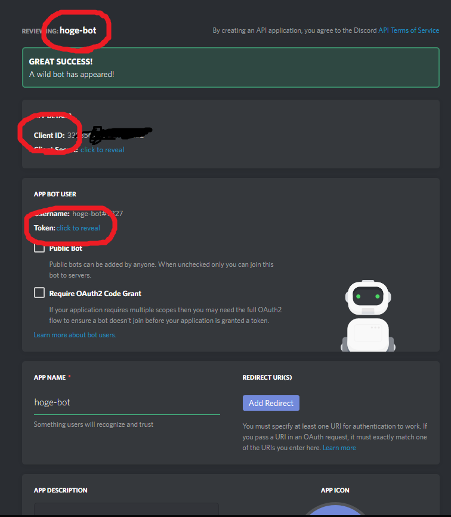

# お試しver
[tos-bot](https://discordapp.com/oauth2/authorize?&client_id=339389975848288266&scope=bot&permissions=0)

# 始め方

1. `git clone https://github.com/writ312/tos-bot.git`
1. `npm install`
1. [create discord bot](https://discordapp.com/developers/applications/me)
1. edit index.js 1~2 Line
1. `npm start`

# botの作り方
上のURLをクリックして適当に頑張る

重要なのは丸の部分
上から順に
1. index.jsの一行目を置き換える
2. https://discordapp.com/oauth2/authorize?&client_id=ここと置き換える&scope=bot&permissions=0  
    置き換えてURLに飛ぶと、管理しているルームにBOTを追加するところに飛べる。管理者または管理者権限がないとだめなので注意。
3. index.jsの２行目を置き換える

ざっくりとした説明だけど、わかんなかったらググれ  
ずっとPC動かさないよーとかいう人はherokuなりbluemixなり使おう

# コマンドどか
コマンドはそれぞれの先頭に` / `または`!`をつける  
例えば翻訳のコマンドは`/t`,`!t`となり、どちらも同じ動作をする

1. `/s(or /search) <text>` textの文字をtos-jp baseの検索にかける
1. `/t(or /trans) <text>` textの韓国語または韓国のサイトを翻訳したリンクを作成する
1. `/b(or /box) <text>` textを名前に持つキャラのもこもこを開けたときに打つと、24時間後にメンションを送る
1. `#delgele` #delgeleチャンネルがあるときに、発言すると水やり、回収の時間を教えてくれる。チャンネルで何か発言がトリガー。
